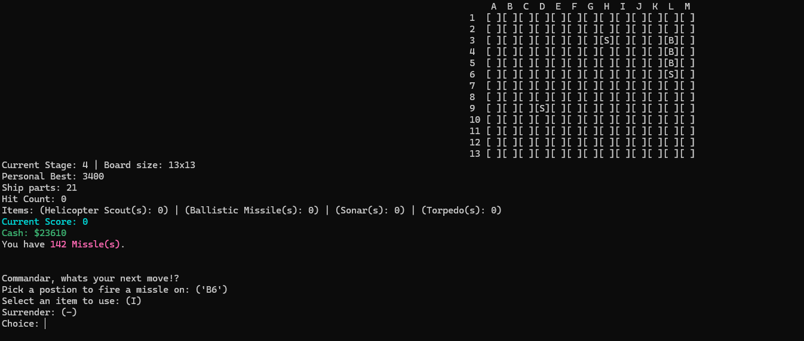
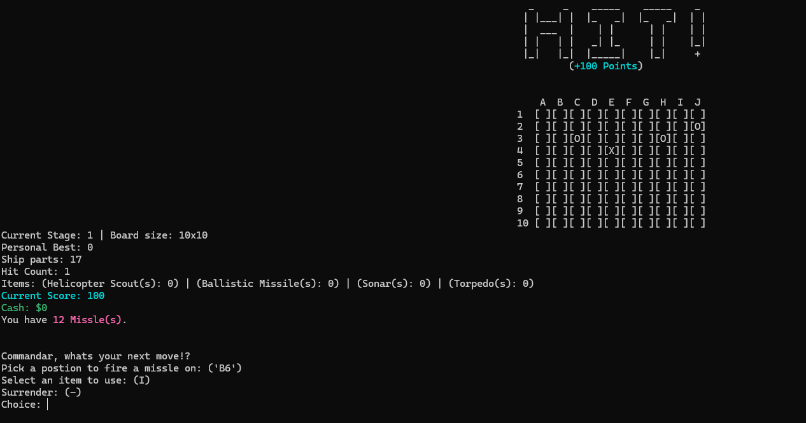
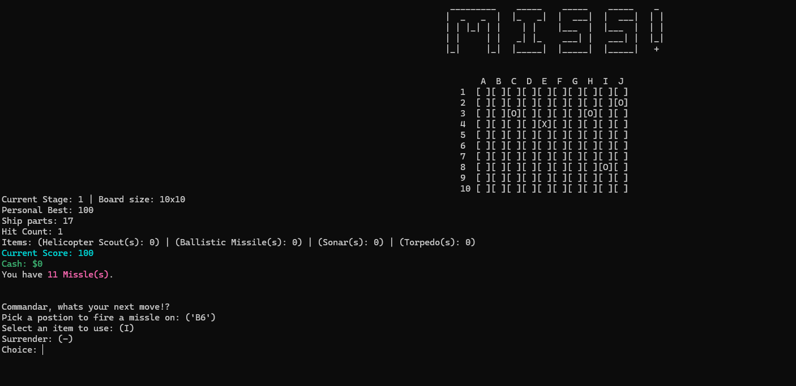
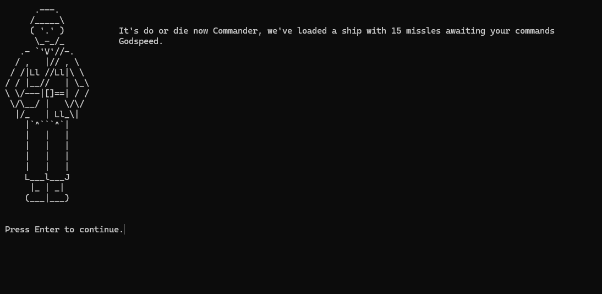
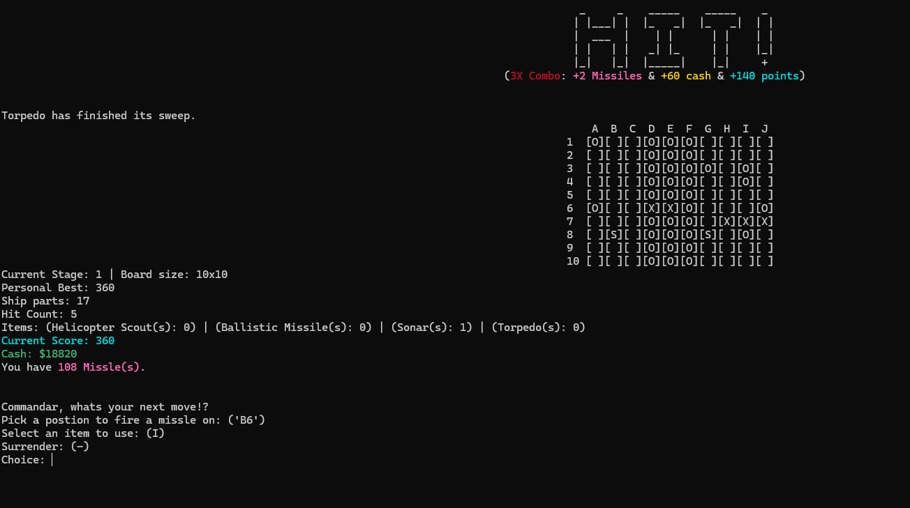
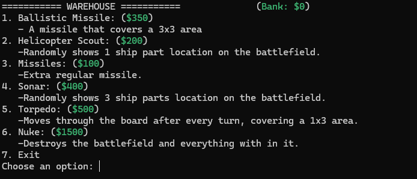

# Battleship-Roguelite-Game

CSIS 297 C++ Project

A terminal-based endless Battleship game built in C++.  
Start with limited resources and fight through as many stages as you can — earning money, buying upgrades, and pushing for the highest score in a single run.

---

##  Game Loop

- Start with 15 missiles and face your first fleet. Each fleet is randomly generated with 5 ships.
- Destroy as many ships as you can, earning money to spend in the warehouse.
- Once you run out of missiles, your run is over.
- After each run, you can spend your cash in the warehouse for items. These items will allow you to progress further and achieve a higher score.
- After each stage, the board grows bigger, and there is a chance for larger fleets.
- Try to get the highest score you can!

---

##  Screenshots

---

## 🛠️ How to Compile

- Open a terminal inside the project folder (outside of `/src`).
- Paste this into your terminal: g++ src/*.cpp -o main